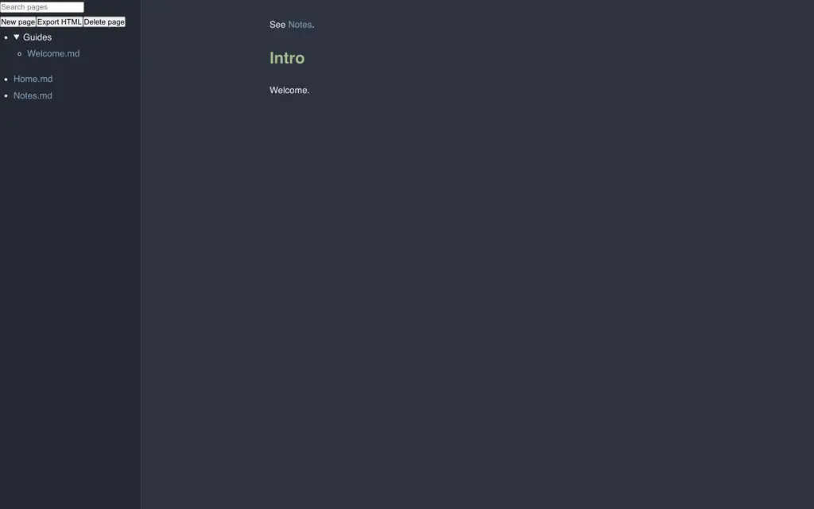

# Glint

Glint is a static Markdown wiki and a self-contained HTML renderer. The browser app opens Markdown from a local folder, Google Drive, or a GitHub repository; files remain in their selected backend.



## Capabilities

- Render GitHub-Flavored Markdown with KaTeX, Mermaid, syntax highlighting, citations, task widgets, and comment blocks.
- Browse nested Markdown folders, follow wiki links, and edit document sections in place.
- Persist changes through the selected local, Drive, or GitHub storage adapter with optimistic concurrency checks.
- Export the current page from the SPA, or render one Markdown file as portable HTML with `glint render`.

## Run the SPA

```bash
npm install
npm run dev
# open http://localhost:8080/#/demo
```

`npm run dev` builds the bundles, stages the Pages layout in `dist-spa/`, and serves it locally. Workspace routes are:

| Source | Route | Requirement |
| --- | --- | --- |
| Demo | `#/demo` | None |
| Local folder | `#/local` | Chromium or Edge File System Access API |
| Google Drive | `#/drive/<folderId>` | Public Drive OAuth client ID in `src/spa/config.js` |
| GitHub | `#/gh/<owner>/<repo>` or `#/gh/<owner>/<repo>/tree/<ref>/<path>` | Fine-grained GitHub token entered in the browser |
| GitHub single file | `#/gh/<owner>/<repo>/blob/<ref>/<path>` | Same GitHub token |
| Single file (Drive/demo) | `#/s/drive/<fileId>` or `#/s/demo/<page>` | Same as the underlying source |

GitHub routes mirror github.com's own URL shape, so pasting a `github.com/<owner>/<repo>/blob/<ref>/<path>` link opens that one file read-only; a `tree` link (or a bare repo URL) opens the folder as a project. Drive `.../file/d/<id>` links open a single file; `.../folders/<id>` links open a folder. The landing page has one box that takes any of these links (or the short `owner/repo/...` form) and detects the source; the **copy-link** button in the sidebar page actions builds the shareable single-file URL for the current page.

**Settings** (top of any workspace) exposes two independent appearance axes — a **skin** (Reader, warm editorial; or Almanac, printed field-guide) that sets layout and typography, and a **palette** (18 colour themes) that sets colour. Any skin renders under any palette, light or dark. A **Layout** section chooses where comments go — **inline** (anchored beneath the source line) or a **side rail** — and toggles an optional page **top bar** (breadcrumb, export, delete). Settings also holds the Vim-keybindings toggle and per-project management: saved projects carry an editable display **name** (rename there), so a long Drive folder ID never overflows the sidebar. Comments are written with an inline compose box, and GitHub credentials are entered through an in-app dialog and kept in memory only. Resolved comment threads collapse behind a "Show resolved" toggle so active discussion stays uncluttered. When a page has more than one heading, the sidebar shows an "On this page" outline that tracks your reading position. Read-only sources (for example a GitHub token without push access) hide the Save and page-editing controls.

See [SPA setup and deployment](docs/spa-setup.md) for OAuth and GitHub Pages details.

## Render one file

```bash
npm run build
npm link

glint render notes/paper.md
glint render notes/paper.md --output output.html --theme nord
```

The render command supports an optional `glint.toml` or `.glint/config.toml` next to the source file:

```toml
theme = "nord"
baseFile = "README.md"

[latex-macros]
RR = "\\mathbb{R}"
```

## Markdown reference

```bash
glint skill
```

The generated reference documents Glint extensions: math, Mermaid, ABC notation, wiki links, citations, tasks, and `comment` fenced blocks.

## Development

```bash
npm run build
npm test
```

GitHub Pages builds the SPA bundles, stages `dist-spa/`, and deploys the static site. The page itself has no Glint server or database; backend access controls remain authoritative.

MIT
