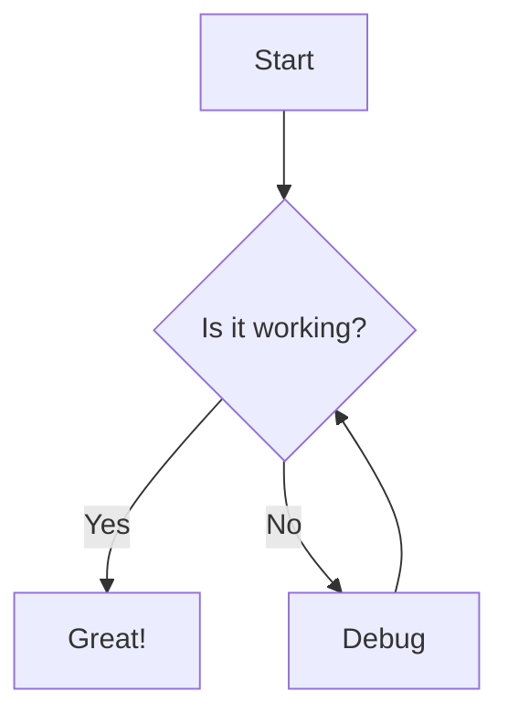

## Glint widget demos

### Comment blocks

````comment
jarred@2026-01-11:14:00 This is a test comment.

clanker@2026-01-11:14:05 Reply to the test.

jarred@2026-01-11:15:07 sup. this is
a multi line comment
With *markdown* **formatting** and $m^a(t){\hbar}$ and 
> quotes

```python
here is how you should have implemented it dummy
```
- [x] Resolve this comment (due:2026-03-04 completed:2026-01-12)
````

```comment
#resolved
jarred@2026-01-11:14:00 This is a test comment.

clanker@2026-01-11:14:05 Reply to the test.

jarred@2026-01-11:15:08 $e=mc^2$

jarred@2026-01-11:15:08 $$e^2 = m^2c^4 + p^2$$
```

```comment
#resolved
summary: bash.org
#important
<Donut[AFK]>@ HEY EURAKARTE
<Donut[AFK]> INSULT
<Eurakarte> RETORT
<Donut[AFK]> COUNTER-RETORT
<Eurakarte> QUESTIONING OF SEXUAL PREFERENCE
<Donut[AFK]> SUGGESTION TO SHUT THE FUCK UP
<Eurakarte> NOTATION THAT YOU CREATE A VACUUM
<Donut[AFK]> RIPOSTE
<Donut[AFK]> ADDON RIPOSTE
<Eurakarte> COUNTER-RIPOSTE
<Donut[AFK]> COUNTER-COUNTER RIPOSTE
<Eurakarte> NONSENSICAL STATEMENT INVOLVING PLANKTON
<Miles_Prower> RESPONSE TO RANDOM STATEMENT AND THREAT TO BAN
OPPOSING SIDES
<Eurakarte> WORDS OF PRAISE FOR FISHFOOD
<Miles_Prower> ACKNOWLEDGEMENT AND ACCEPTENCE OF TERMS
jarred@2026-01-11:15:07 sup
```

### Task lists

- Not a task
- Also not a task
  - Definitely not a task.
- [ ] Buy milk
- [ ] Submit expenses (created:2025-12-25 due:2026-02-05 @clanker #urgent)
- [w] Pay invoice (due:2026-02-05 completed:2026-01-11)
  - Not a subtask.
  - [x] Submit invoice (due:2026-02-05 completed:2026-01-22)
  - [w] Wait for transaction to clear (due:2026-02-05 remind:2026-02-01)
- [x] Review PR #42 (@jarred)

### Mermaid Diagrams

Here is a flow chart:


### Code blocks

```python
def fib(n):
  if n <= 1:
    return 1
  else:
    return fib(n-1) + fib(n-2)
```


## 1. The Gaussian Integral

**Goal:** To evaluate the integral $I = \int_{-\infty}^{\infty} e^{-x^2} dx$ using a polar coordinate transformation.

We consider the square of the integral:

$$ I^2 = \left( \int_{-\infty}^{\infty} e^{-x^2} dx \right) \left( \int_{-\infty}^{\infty} e^{-y^2} dy \right) $$

Combining them into a double integral over the $xy$-plane:

$$ I^2 = \int_{-\infty}^{\infty} \int_{-\infty}^{\infty} e^{-(x^2 + y^2)} dx \, dy $$


Changing to polar coordinates where $x^2 + y^2 = r^2$ and the Jacobian $dx \, dy = r \, dr \, d\theta$:

$$
\begin{align*}
I^2 &= \int_{0}^{2\pi} d\theta \int_{0}^{\infty} e^{-r^2} r \, dr \\
&= 2\pi \int_{0}^{\infty} e^{-r^2} r \, dr
\end{align*}
$$

Using $u$-substitution with $u = r^2, du = 2r \, dr$:
$$
\begin{align*}
I^2 &= 2\pi \left[ -\frac{1}{2} e^{-r^2} \right]_{0}^{\infty} \\
&= \pi (0 - (-1)) \\&= \pi
\end{align*}
$$

Therefore:
$$\int_{-\infty}^{\infty} e^{-x^2} dx = \sqrt{\pi}$$

---

## 2. The Euler-Lagrange Equation

**Goal:** To find the function $q(t)$ that extremizes the action functional $S[q] = \int_{t_1}^{t_2} \mathcal{L}(q, \dot{q}, t) dt$.

We consider a variation $\delta q(t)$ such that $\delta q(t_1) = \delta q(t_2) = 0$. The extremum condition is $\delta S = 0$:
$$ \delta S = \int_{t_1}^{t_2} \left( \frac{\partial \mathcal{L}}{\partial q} \delta q + \frac{\partial \mathcal{L}}{\partial \dot{q}} \delta \dot{q} \right) dt = 0 $$

Since $\delta \dot{q} = \frac{d}{dt} \delta q$, we apply integration by parts to the second term:


$$ \int_{t_1}^{t_2} \frac{\partial \mathcal{L}}{\partial \dot{q}} \frac{d}{dt}(\delta q) dt = \left( \frac{\partial \mathcal{L}}{\partial \dot{q}} \delta q \right)_{t_1}^{t_2} - \int_{t_1}^{t_2} \frac{d}{dt} \left( \frac{\partial \mathcal{L}}{\partial \dot{q}} \right) \delta q \, dt $$


The boundary term vanishes because $\delta q(t_1) = \delta q(t_2) = 0$. Substituting this back:

$$ \int_{t_1}^{t_2} \left( \frac{\partial \mathcal{L}}{\partial q} - \frac{d}{dt} \frac{\partial \mathcal{L}}{\partial \dot{q}} \right) \delta q \, dt = 0 $$


By the Fundamental Lemma of the Calculus of Variations, the integrand must vanish:
$$\frac{\partial \mathcal{L}}{\partial q} - \frac{d}{dt} \left( \frac{\partial \mathcal{L}}{\partial \dot{q}} \right) = 0$$

---

## 3. Noether's Theorem (Field Theory)


Assume the Lagrangian $\mathcal{L}(\phi, \partial_\mu \phi)$ is invariant under $\phi \to \phi + \epsilon \Delta \phi$. The change in $\mathcal{L}$ is:
$$ * \delta \mathcal{L} = \frac{\partial \mathcal{L}}{\partial \phi} \delta \phi + \frac{\partial \mathcal{L}}{\partial(\partial_\mu \phi)} \delta(\partial_\mu \phi) $$

Substituting the Euler-Lagrange equation $\frac{\partial \mathcal{L}}{\partial \phi} = \partial_\mu \frac{\partial \mathcal{L}}{\partial(\partial_\mu \phi)}$:
$$
\begin{align*}
\delta \mathcal{L} &= \left( \partial_\mu \frac{\partial \mathcal{L}}{\partial(\partial_\mu \phi)} \right) \delta \phi + \frac{\partial \mathcal{L}}{\partial(\partial_\mu \phi)} \partial_\mu(\delta \phi) \\
&= \partial_\mu \left( \frac{\partial \mathcal{L}}{\partial(\partial_\mu \phi)} \delta \phi \right)

```comment
```

\end{align*}
$$

If the transformation is a symmetry, then $\delta \mathcal{L} = \epsilon \partial_\mu K^\mu$ for some vector $K^\mu$. Setting these equal:
$$ \epsilon \partial_\mu \left( \frac{\partial \mathcal{L}}{\partial(\partial_\mu \phi)} \Delta \phi \right) = \epsilon \partial_\mu K^\mu $$

Rearranging gives the divergence-free current:
$$ \partial_\mu \left( \frac{\partial \mathcal{L}}{\partial(\partial_\mu \phi)} \Delta \phi - K^\mu \right) = 0 $$

The Noether current is thus:
$$j^\mu = \frac{\partial \mathcal{L}}{\partial(\partial_\mu \phi)} \Delta \phi - K^\mu$$

---

## 4. Einstein Field Equations

**Goal:** To derive the EFE from the Einstein-Hilbert action $S = \int \left( \frac{1}{2\kappa} R + \mathcal{L}_M \right) \sqrt{-g} \, d^4x$.

Varying the action with respect to the inverse metric $g^{\mu\nu}$:

$$ \delta S = \int \left[ \frac{1}{2\kappa} \left( \frac{\delta(\sqrt{-g}R)}{\delta g^{\mu\nu}} \right) + \frac{\delta(\sqrt{-g}\mathcal{L}_M)}{\delta g^{\mu\nu}} \right] \delta g^{\mu\nu} d^4x = 0 $$

Using the variation of the Ricci scalar $R = g^{\mu\nu} R_{\mu\nu}$:

$$ \delta(\sqrt{-g}R) = R_{\mu\nu} \delta(g^{\mu\nu}\sqrt{-g}) + \sqrt{-g} g^{\mu\nu} \delta R_{\mu\nu} $$

The second term (Palatini identity) is a total divergence and vanishes. Using Jacobi's formula for the variation of the determinant $\delta \sqrt{-g} = -\frac{1}{2}\sqrt{-g}g_{\mu\nu}\delta g^{\mu\nu}$:

$$ \delta(\sqrt{-g}R) = \sqrt{-g} \left( R_{\mu\nu} - \frac{1}{2} R g_{\mu\nu} \right) \delta g^{\mu\nu} $$

Defining the Energy-Momentum tensor $T_{\mu\nu} = -2 \frac{1}{\sqrt{-g}} \frac{\delta(\sqrt{-g}\mathcal{L}_M)}{\delta g^{\mu\nu}}$:

$$ \frac{1}{2\kappa} \sqrt{-g} \left( R_{\mu\nu} - \frac{1}{2} R g_{\mu\nu} \right) - \frac{1}{2} \sqrt{-g} T_{\mu\nu} = 0 $$

Rearranging with $\kappa = 8\pi G/c^4$ gives:

$$R_{\mu\nu} - \frac{1}{2}R g_{\mu\nu} + \Lambda g_{\mu\nu} = \frac{8\pi G}{c^4} T_{\mu\nu}$$
