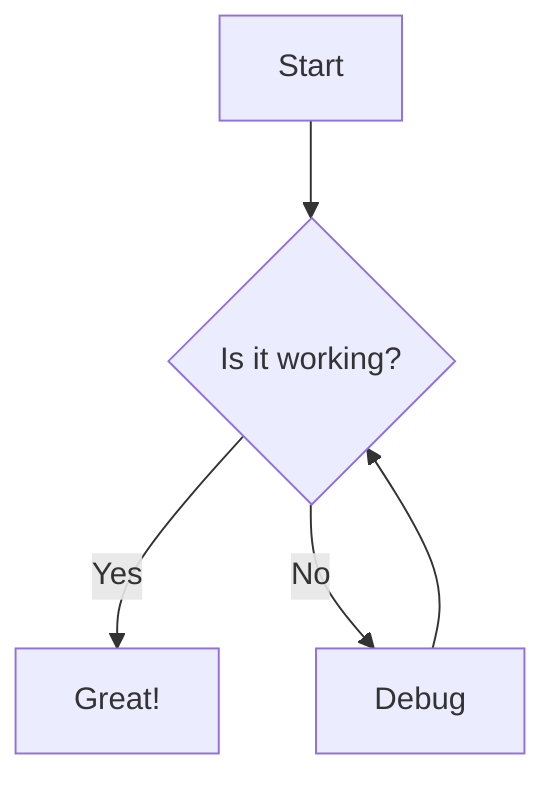
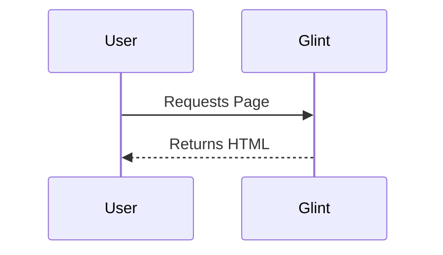
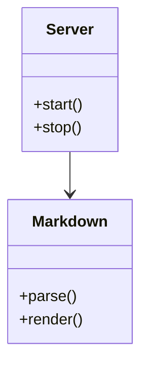

# Mermaid Diagrams

Here is a flow chart:

```mermaid
graph TD;
    A[Start] --> B{Is it working?};
    B -- Yes --> C[Great!];
    B -- No --> D[Debug];
    D --> B;
```

Here is a sequence diagram:

```mermaid
sequenceDiagram
    participant User
    participant Glint
    User->>Glint: Requests Page
    Glint-->>User: Returns HTML
```

Here is a class diagram:

```mermaid
classDiagram
    class Server {
        +start()
        +stop()
    }
    class Markdown {
        +parse()
        +render()
    }
    Server --> Markdown
```
