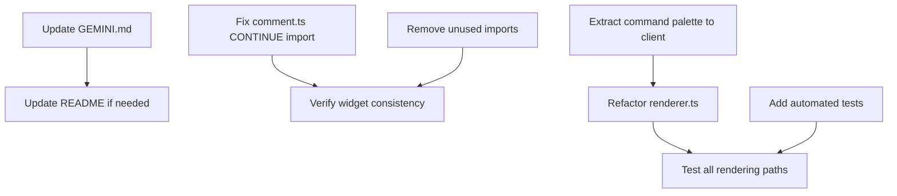

# Glint Code Review

> Architecture analysis and recommendations for anti-fragile system design.
> Reviewed: 2026-01-12

---

## Executive Summary

The Glint codebase has undergone significant improvements since the previous review. Dead code has been cleaned up, the client has been properly modularized, error handling uses typed classes, and Mermaid is now theme-aware. However, the documentation is stale and needs updating. This review identifies remaining issues and proposes dependency-aware improvements.

---

## ✅ Issues Resolved Since Last Review

| Issue | Status |
|-------|--------|
| Dead `rehype-glint-katex.ts` | ✅ Deleted |
| Dead `rehype-math-enumerate.ts` | ✅ Deleted |
| Dead `remark-slash-checkbox.ts` | ✅ Deleted |
| Monolithic `editor-integration.ts` (1198 lines) | ✅ Refactored to 173 lines + 8 modules |
| String-based error handling | ✅ Now uses typed `ForbiddenError`/`NotFoundError` |
| Hardcoded Mermaid colors | ✅ Theme-aware config with 6 themes |
| CONTINUE constant inconsistency | ⚠️ Partially fixed (task.ts uses import, comment.ts still defines locally) |

---

## Architecture Overview (Current State)

### Core Stack

- **Runtime:** Node.js (ESM)
- **Server:** Fastify with auth, SSE, shares, and task scanning
- **Markdown:** unified ecosystem (remark → rehype)
- **Editor:** CodeMirror 6 with vim mode
- **Build:** TypeScript + esbuild

### New Features (Undocumented)

| Feature | Files |
|---------|-------|
| Authentication system | `server/auth.ts`, `server/routes/auth.ts` |
| Shareable links | `server/share.ts`, `client/share.ts` |
| Task aggregation view | `tasks/scanner.ts`, `server/routes/tasks.ts`, `client/task-view.ts` |
| Citations | `remark-glint-citations.ts`, `rehype-glint-citations.ts`, `client/citations.ts` |
| Git integration | `server/routes/git.ts` |
| Command palette | Inline in `renderer.ts` |
| Config migration | `.glint/config.json` now preferred over `glint.json` |

---

## 🔴 Critical Issues

### 1. `renderer.ts` is 756 Lines — Too Large

**File:** `src/renderer.ts`

This monolithic file handles too many responsibilities:

- HTML head rendering
- Sidebar generation
- Script injection with inline JS
- Command palette (150+ lines of inline JS)
- Metadata formatting
- Right outline
- Breadcrumbs
- Login page
- Share modal

**Impact:** Hard to test, modify, and reason about. The command palette logic is particularly problematic as inline script.

**Recommendation:** Extract into focused modules:

```
src/renderer/
├── head.ts           # HTML head with theme
├── sidebar.ts        # Full sidebar including views/files
├── scripts.ts        # Bundle loading and SSE
├── command-palette.ts # Moved to client bundle
├── metadata.ts       # Frontmatter display
├── outline.ts        # Right-side TOC
├── breadcrumbs.ts    # Navigation breadcrumbs
├── login.ts          # Login page
└── share-modal.ts    # Share UI (or move to client)
```

---

### 2. Config Still Loaded Separately in `api.ts`

**Files:** `server.ts` line 78, `server/routes/api.ts` (inferred from signature)

The api routes receive a `getConfig` function but also previously loaded config separately. Need to verify this is now consistent.

**Current:** `setupAPIRoutes(fastify, contentDir, getConfig, broadcast, taskScanner)`

**Status:** ✅ Appears fixed — config is now passed via `getConfig()`.

---

### 3. CONTINUE Constant Inconsistency (Minor)

**Files:** `widgets/task.ts`, `widgets/comment.ts`

```typescript
// task.ts - correct
import { CONTINUE } from 'unist-util-visit';

// comment.ts - manual definition
const CONTINUE = undefined;
```

**Recommendation:** Use the official import in `comment.ts`.

---

## 🟡 Medium Priority Issues

### 4. Comment Widget `visit` Import Unused

**File:** `src/widgets/comment.ts` line 1

```typescript
import { visit } from 'unist-util-visit';
```

The `visit` function is imported but never called — only `VisitorResult` type is used.

**Impact:** Minor dead code in imports.

**Fix:** Change to type-only import: `import type { VisitorResult } from 'unist-util-visit';`

---

### 5. TaskScanner Has Unused Import

**File:** `src/tasks/scanner.ts` line 5

```typescript
import { resolveContentPath } from '../utils/fs-utils.js';
```

This import is declared but never used in the scanner.

---

### 6. Share Modal Should be a Client Module

**File:** `src/renderer.ts` lines 573-617

The share modal HTML is rendered server-side but all its interactivity comes from `client/share.ts`. This creates duplication and makes the modal hard to maintain.

**Recommendation:** Generate the modal structure from `share.ts` or use a lightweight template.

---

### 7. Command Palette Inline Script

**File:** `src/renderer.ts` lines 436-558

150+ lines of JavaScript rendered inline in HTML. This should be a separate client bundle.

**Recommendation:** Create `src/client/command-palette.ts` and add to bundle:client script.

---

## 🟢 Low Priority / Future Enhancements

### 8. Documentation is Stale

**Files:** `GEMINI.md`, `docs/` SPEC files

- `GEMINI.md` refers to files that no longer exist
- Directory structure section is outdated
- No mention of auth, shares, tasks, citations, git routes
- Pipeline docs don't include citations plugins
- REST API table missing new endpoints

---

### 9. No TypeScript Strict Mode

**File:** `tsconfig.json`

Consider enabling `"strict": true` for better type safety.

---

### 10. No Automated Tests

The codebase has no unit or integration tests. While manual testing is documented, automated tests would catch regressions.

---

### 11. Wiki Links Still Don't Validate Targets

**File:** `src/remark-wiki-link-glint.ts`

Links like `[[Page Name]]` are converted but existence isn't checked.

---

### 12. No Mobile Sidebar Collapse (UX)

Mobile toggle exists (`div.mobile-toggle`) but behavior may need refinement.

---

## Architecture Observations

### Good Patterns ✓

- **LRU caching** with mtime invalidation
- **SSE hot-reload** with editing suppression
- **Optimistic locking** via content hash
- **Typed errors** with type guards
- **Modular plugin pipeline** using unified
- **Clean widget handler interface**
- **Auth with bcrypt + signed sessions**
- **Theme-aware Mermaid configuration**
- **Client modularization** (21 files)

### Anti-Fragility Opportunities

1. **Decouple renderer.ts** — Single largest complexity hotspot
2. **Add integration tests** — Catch regressions in pipeline
3. **Typed share service** — `any` used to avoid circular deps
4. **Config validation on startup** — Fail fast with clear errors
5. **Circuit breaker for file watcher** — Prevent cascade on rapid changes

---

## Dependency Graph for Fixes



---

## Recommended Priorities

| Priority | Issue | Effort | Dependencies |
|----------|-------|--------|--------------|
| 🔴 High | Update `GEMINI.md` documentation | Low | None |
| 🔴 High | Extract command palette to client bundle | Medium | None |
| 🟡 Medium | Refactor `renderer.ts` into modules | High | Command palette extraction |
| 🟡 Medium | Fix minor import issues | Low | None |
| 🟢 Low | Add TypeScript strict mode | Medium | Import fixes |
| 🟢 Low | Add automated tests | High | Refactoring |
| 🔵 Future | Wiki link validation | Medium | None |
| 🔵 Future | Full-text search | High | None |

---

## Client Bundle Status

Current bundles from `package.json`:

- `editor.bundle.js` — CodeMirror wrapper
- `router.bundle.js` — SPA navigation
- `upload.bundle.js` — Image paste/upload
- `editor-integration.bundle.js` — Editing coordination
- `image-resize.bundle.js` — Drag resize
- `drag-reorder.bundle.js` — Section reordering
- `share.bundle.js` — Share links
- `outline.bundle.js` — TOC interactions
- `citations.bundle.js` — Citation hover cards
- `task-view.bundle.js` — Task dashboard

**Missing:**

- Command palette (currently inline)

---

## Files to Reference

| Purpose | Location |
|---------|----------|
| Unified pipeline | `server.ts:53-75` |
| Auth setup | `server/auth.ts` |
| Widget registration | `widgets/index.ts` |
| Task parsing | `tasks/parser.ts` |
| Error types | `utils/errors.ts` |
| Config schema | `config.ts` |
