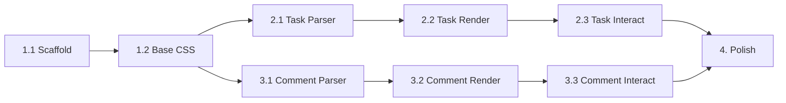

# V3 Tasks — Embedded Widgets

IMPORTANT: DO **NOT** run `npm run dev`. It causes problems and I need to kill it. If restarting the dev server is needed, alert the user to do it for you.

IMPORTANT: Update the sections of this document with notes/status as you work.

Implementation breakdown for [SPEC_V3_inline.md](./SPEC_V3_inline.md).

---

## Phase 1: Core Infrastructure

### 1.1 Create Plugin Entry Point

Create `src/remark-glint-widgets.ts`:

```typescript
import { visit } from 'unist-util-visit';
import type { Root } from 'mdast';

export function remarkGlintWidgets() {
    return (tree: Root) => {
        visit(tree, (node) => {
            // TODO: Dispatch to widget handlers
        });
    };
}
```

- [x] Create the file with basic structure above
- [x] Export the plugin function

### 1.2 Create Widget Directory

```bash
src/widgets/
  index.ts        # Re-exports all widget handlers
  types.ts        # Shared types (WidgetNode, etc.)
  task.ts         # Task widget (Phase 2)
  comment.ts      # Comment widget (Phase 3)
```

- [x] Create `src/widgets/` directory
- [x] Create `src/widgets/types.ts` with shared interfaces:

```typescript
export interface WidgetHandler {
    match: (node: unknown) => boolean;
    transform: (node: unknown) => unknown;
}
```

- [x] Create `src/widgets/index.ts` that exports handlers array

### 1.3 Register in Pipeline

In `src/server.ts`, add after `remarkGfm`:

```typescript
import { remarkGlintWidgets } from './remark-glint-widgets.js';

// In createProcessor():
.use(remarkGfm)
.use(remarkGlintWidgets)  // <-- Add here
.use(remarkSlashCheckbox)
```

- [x] Import the plugin
- [x] Add `.use(remarkGlintWidgets)` to pipeline
- [x] Verify server starts without errors

### 1.4 Base CSS Variables

Add to `assets/layout.css`:

```css
:root {
    /* Widget base */
    --widget-bg: var(--bg-secondary);
    --widget-border: var(--border);
    --widget-radius: 6px;
    
    /* Task states */
    --task-open: #3b82f6;      /* blue */
    --task-done: #22c55e;      /* green */
    --task-blocked: #ef4444;   /* red */
    --task-waiting: #f59e0b;   /* amber */
    --task-progress: #8b5cf6;  /* purple */
}
```

- [x] Add CSS variables to `:root`
- [x] Add `.glint-widget` base class:

```css
.glint-widget {
    margin: 0.5rem 0;
    padding: 0.5rem 0.75rem;
    border-radius: var(--widget-radius);
    border-left: 3px solid var(--accent);
    background: var(--widget-bg);
}
```

### 1.5 Verify Setup

- [x] Run `npm run build`
- [x] Confirm no errors
- [ ] Add a test task line to a markdown file
- [ ] Confirm it renders (as plain text for now — handler not implemented yet)

---

## Phase 2: Tasks Widget

**Syntax:** `- [<state>] <description> (<attrs> @assignee #<priority>)`

**Attrs** (space-separated `key:value`, no spaces around `:`):

| Attr | Format | Example |
|------|--------|---------|
| `due` | `YYYY-MM-DD` | `due:2026-02-05` |
| `completed` | `YYYY-MM-DD` or `YYYY-MM-DD:HH:MM` | `completed:2026-01-11` |
| `created` | `YYYY-MM-DD` or `YYYY-MM-DD:HH:MM` | `created:2026-01-10` |
| `scheduled` | `YYYY-MM-DD` | `scheduled:2026-02-01` |
| `assignee` | `@username` | `@clanker` |

**States:**

| Char | Meaning |
|------|---------|
| ` ` | Open |
| `x` | Done |
| `/` | In progress |
| `w` | Waiting |
| `b` | Blocked |

**Priorities:** `#low`, `#normal` (default), `#urgent`

**Examples:**

```markdown
- [ ] Buy milk
- [x] Submit expenses (due:2026-02-05 completed:2026-01-11 @clanker #urgent)
- [w] Pay invoice (due:2026-02-05 completed:2026-01-11)
- [/] Review PR #42 (@jarred)
```

### 2.1 Parser

- [x] Create `src/widgets/task.ts`
- [x] Implement parser for task: description attributes
- [x] Emit HAST `<div class="glint-task">` with data attributes

### 2.2 Rendering

- [x] Style task states: open (🟦), done (✅), blocked (⛔), waiting (⌛), in progress (🏃)
- [x] Format due dates (relative vs absolute)
- [x] Highlight overdue tasks
- [x] Add `data-source-line` for editor integration

### 2.3 Interactions

- [x] Click checkbox → toggle `state=open` ↔ `state=done`
- [x] Write state change back to markdown via `/api/save`
- [x] Automatically add `completed:YYYY-MM-DD` when marking done
- [ ] Optional: date picker for due date

---

## Phase 3: Comments Widget

### 3.1 Parser

- [x] Create `src/widgets/comment.ts`
- [x] Handle ` ```comment ` code blocks
- [x] Parse `author@timestamp message` format per line
- [x] Handle `#resolved`, `#important` flags
- [x] **CRITICAL**: Use MDAST `html` node (not raw HAST) for `rehype-raw` compatibility

### 3.2 Rendering

- [x] Thread layout with vertical item spacing
- [ ] Format timestamps (relative: "2h ago") — *Deferred to Phase 4*
- [ ] Collapsed/dimmed style for `#resolved` threads
- [x] Style comment entries (header, author, date, content)
- [x] **CRITICAL**: Apply `sourceLineOffset` for accurate frontmatter-aware mapping

### 3.3 Interactions

- [x] [Reply] button → prompt for author (stored in localStorage), append to source
- [x] [Resolve] button → prepend `#resolved` flag to block
- [x] Store author name in localStorage
- [x] Write changes back via `/api/save`

---

## Phase 4: Polish

### 4.1 UX Refinements

- [ ] Keyboard shortcut to insert comment block
- [ ] Hover actions for tasks (quick-resolve, set due)
- [ ] SSE reload suppression during widget edit

### 4.2 Config

- [ ] Add `widgets` section to `glint.json` schema
- [ ] `taskDueDateFormat`: relative | absolute

### 4.3 Documentation

- [ ] Update GEMINI.md with widget architecture
- [ ] Add examples to README

---

## Order of Implementation



**Recommended start:** Phase 2 (Tasks) — simpler than comments, proves the pattern.
