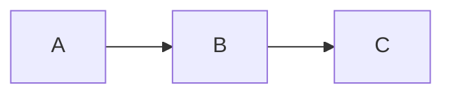

# Glint Markdown Extensions

Glint renders standard Markdown plus the extensions below. Use this as a reference when writing content for the static SPA or the `glint-md render` command.

## Math (KaTeX)

Inline: `$E = mc^2$`
Block (separate with blank lines):

```
$$
\int_0^\infty e^{-x^2} dx = \frac{\sqrt{\pi}}{2}
$$
```

Define document-specific macros in YAML frontmatter. The leading backslash on the macro name is optional:

```
---
latex-macros:
  R: \mathbb{R}
  vec: \mathbf{#1}
---

Use $\R$ and $\vec{x}$ in the document.
```

Numbering is opt-in. Add `\tag{label}` to number one display equation:

```
$$
E = mc^2 \tag{1}
$$
```

Use an unstarred KaTeX environment such as `align` to number each row automatically; use `align*` to suppress numbering:

```
$$
\begin{align}
x &= 1 \\
y &= 2
\end{align}
$$
```

### Labels and cross-references

Label a single display equation with `\label{eq:key}`. Glint numbers labeled equations in order and renders that number as the equation tag. Reference one in prose with `[[#eq:key]]`, which shows the number and links to the equation.

```
$$
E = mc^2 \label{eq:mass}
$$

Combined with [[#eq:momentum]], equation [[#eq:mass]] gives...
```

References may point forward or backward. An unknown key renders as `(?)` with the `broken-link` class. Labels apply to single display equations only; multi-row environments like `align` keep their own KaTeX numbering.

## Mermaid Diagrams



Rendered client-side. Any valid Mermaid diagram type is supported.

## HTML

Glint accepts a passive HTML vocabulary inline with the article. It includes normal formatting and table elements plus `img`, `figure`, `figcaption`, `details`, `summary`, `audio`, `video`, `kbd`, `mark`, `abbr`, and `cite`.

Only element-specific presentation attributes survive. Event handlers, `style`, forms, document metadata, executable elements, `srcdoc`, `data-*`, reserved Glint classes, and executable URL schemes are removed from passive HTML. Links may use relative, `http`, `https`, `mailto`, or `tel` URLs. Media may use relative, `http`, or `https` URLs; images may also use supported base64 image data URLs.

Image `width` and `height` values are bounded to 4096 pixels. Image widths may instead use percentages from `1%` through `100%`. Use `align-left`, `align-center`, or `align-right` on an `img` or `figure`; arbitrary classes and CSS are removed.

```html
<figure class="align-right">
  
  <figcaption>Request flow</figcaption>
</figure>
```

A complete block-level HTML fragment containing any element outside the passive vocabulary is a custom embed. Glint places the whole fragment in an opaque sandbox that allows scripts and presentation APIs but not same-origin access, forms, navigation, popups, or downloads.

```html
<custom-chart>
  <script src="https://example.com/chart.js"></script>
</custom-chart>
```

Keep a custom fragment complete and within one Markdown block. Glint displays unknown inline HTML and incomplete or malformed fragments literally instead of interpreting them. SPA HTML exports omit custom embeds for offline safety; the CLI and `--body-only` output retain them inside the same opaque sandbox.

## Wiki Links

`[[Page Name]]` links to `Page Name.md`
`[[Page Name|Label]]` links with a custom label

Broken links (file not found) render with a `broken-link` CSS class.

## Citations

Inline: `[[#ref:mykey]]` renders as a numbered superscript.

Reference list (must be under a `## References` heading):

```
## References

- [ref:mykey] "Title of Work" Author Name (2024) https://example.com
```

Citations are auto-numbered in order of appearance.

## Task Widget

Tasks are list items with a bracketed state marker:

| Syntax | State |
|--------|-------|
| `- [ ] description` | open |
| `- [x] description` | done |
| `- [/] description` | in progress |
| `- [w] description` | waiting |
| `- [b] description` | blocked |
| `- [c] description` | cancelled |

Optional metadata goes in trailing parentheses:

```
- [ ] Fix the bug (#high @alice due:2024-12-01 scheduled:2024-11-28 created:2024-11-01)
```

Metadata tokens: `#priority`, `@assignee`, `due:YYYY-MM-DD`, `scheduled:YYYY-MM-DD`, `created:YYYY-MM-DD`, `completed:YYYY-MM-DD`. Omit any token that does not apply.

## GitHub-Flavored Markdown

Standard GFM is fully supported: tables, strikethrough (`~~text~~`), task checkboxes in lists, fenced code blocks with syntax highlighting, and autolinked URLs.
